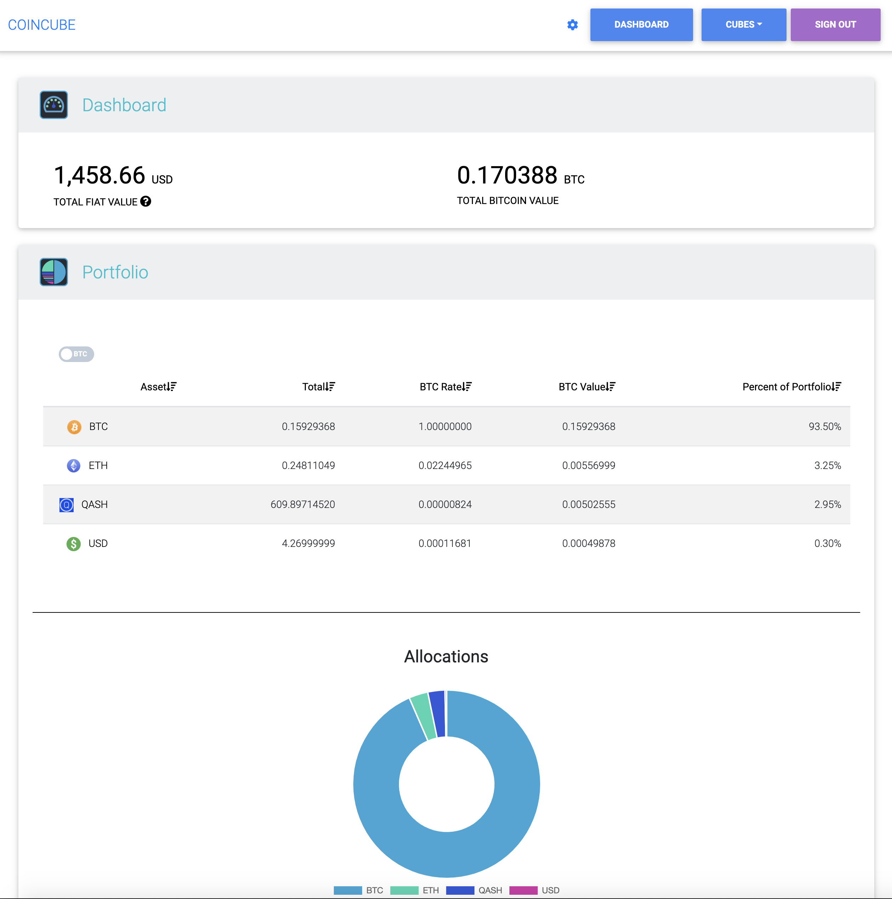

## COINCUBE | Crypto Portfolio Management
##### A Python/Vue.js crypto portfolio management and trade automation program with support for 10 exchanges.

##### Powered by <a href="https://github.com/ccxt/ccxt" target="_blank">ccxt</a>.

### Manage funds across multiple exchange accounts


### Supported exchanges:
#### Binance, Bitfinex, Bitstamp, Bittrex, Coinbase Pro, Coss, Kraken, Kucoin, Liquid, and Poloniex


### Fully customizable portfolios


### Trade engine - periodic or one-off rebalancing with a few button clicks


## Getting Started
You will need some developer tools to get up and running. Please install <a href="https://git-scm.com/book/en/v2/Getting-Started-Installing-Git">git</a>, <a href="https://www.docker.com/products/developer-tools">docker</a>, and <a href="https://nodejs.org/en/download/">node</a>.

You will also need <a href="https://www.python.org/downloads/">python3</a>, <a href="https://pip.pypa.io/en/stable/installing/">pip</a>, and  `pycrypto` installed locally. Once you have `pip` installed, you can run:
```
pip install pycrypto
```
## Clone repo
```
git clone https://github.com/coincubellc/coincube.git
```
Change to root directory
```
cd coincube
```

## Fetch all submodules
```
git submodule update --init --recursive
```
# Build back
```
cd back
```

### Add CMC_API_KEY from Coin Market Cap
1. Visit <a href="https://pro.coinmarketcap.com/signup/">Coin Market Cap</a> and signup for their free Basic API. 
2. Paste the API key into lines 46 and 72 in `docker-compose.yml`. The key should be a string: `CMC_API_KEY: 'your_CMC_API_key_here'`.
3. Save `docker-compose.yml`.

### Add VAULT_SEED
<p>You'll need to securely generated a base64 encoded RSA Private key. This will be used to encrypt your API keys and other sensitive data in the database.
</p>

1. From inside of the `back` folder, generate a new seed `python generate_vault_seed.py` which will generate a new seed.
2. Paste the entire encoded key except for the preceding 'b' as a string on lines 18 and 113 of `docker-compose.yml`
3. These two lines should look something like: `VAULT_SEED: 'LS0tLS1CRUdJTiBSU0......TVV6UWh3PT0KLS0tLS1FTkQgUlNBIFBSSVZBVEUgS0VZLS0tLS0='`
4. Save `docker-compose.yml`.

### Docker Setup
You will need <a href="https://docker.com" target="_blank">Docker</a>.

Build the Docker container(s):
```
docker-compose build
```

Run the Docker container(s):
```
docker-compose up
```

### Important!
The first time you run `docker-compose up` you will need to wait for the database to be populated. This should take 10-15 minutes.


# Build front
```bash
cd ../front
```
```
npm install
```

### Compiles and hot-reloads for development
This is the way you should run the front-end for local use. 
```
npm run serve
```

### Compiles and minifies for production
If you plan to run in a production environment you'll want to use this command.
```
npm run build
```

# Using Application
Once front and back are running, navigate to: http://0.0.0.0:8080 in your browser.

# To connect directly to the database
TCP/IP <br>
Name: local <br>
Host: 127.0.0.1 <br>
Username: admin <br>
Password: 4pa1z&ABK78R <br>
Database: coincube <br>
Port: 3306

